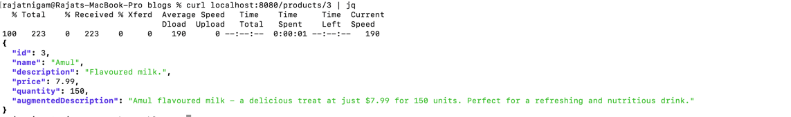
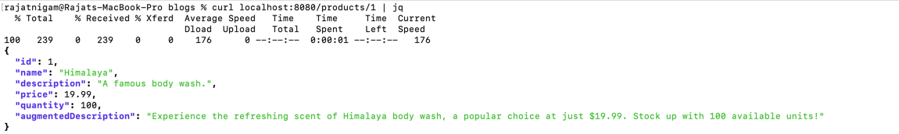

# Product Information Augmentation

## Use Case
Let's consider a scenario where we have a microservice responsible for managing a product catalog for an e-commerce platform. This microservice, built using the Spring Boot framework, utilizes Hibernate for database interaction and Gen AI for augmenting product descriptions with additional information.

## Current System Overview
- The Spring Boot microservice provides endpoints to retrieve and manage product information stored in a relational database.
- Hibernate ORM is used for mapping Java objects to database tables, handling CRUD operations, and managing database transactions.

## Integration of Gen AI for Augmentation
- When a client requests product information, the microservice fetches basic product details from the database using Hibernate.
- After retrieving the basic information, the microservice invokes a Gen AI service to augment the product descriptions with additional relevant details such as sentiment analysis, related product recommendations, or user reviews.

## Tech Stack:
- Spring Boot 3.2.5: The foundation of the application, providing a robust and efficient framework for building web applications.
- Spring Reactive Data R2DBC: Enables reactive programming with R2DBC (Reactive Relational Database Connectivity) for efficient data access and scalability.
- H2 Database: An in-memory database used for development and testing purposes.
- Spring AI OpenAI Starter: A Spring Boot starter that simplifies the integration of OpenAI's GPT-3 language model into the application.

## Implementation Steps
- Configure the Spring Boot application to integrate with Hibernate for database interaction.
- Implement RESTful endpoints to handle product information requests and responses.
- Integrate Gen AI service into the microservice to augment product descriptions. This integration could be achieved through HTTP requests or SDKs provided by the Gen AI platform.
- Upon receiving a request for product information, the microservice retrieves the necessary data from the database using Hibernate.
- Once the basic product details are obtained, the microservice sends a request to the Gen AI service, providing the product descriptions for augmentation.
- Gen AI processes the descriptions, adds relevant information, and returns the augmented data to the microservice.
- Finally, the microservice combines the original product information with the augmented details and sends the enriched response back to the client.

## Example Implementation
```
@Service
@Transactional
public class ProductServiceImpl implements ProductService {

    private ProductRepository productRepository;
    private GenAIService genAIService;

    public ProductServiceImpl(ProductRepository productRepository, GenAIService genAIService) {
        this.productRepository = productRepository;
        this.genAIService = genAIService;
    }

    @Override
    public Mono<Product> save(Product product) {
        return productRepository.save(product).map(p -> p.withAugmentedDescription(genAIService.generateAugmentedDescription(p.toString())));
    }

    @Override
    public Mono<Product> getProductById(Long id) {
        return productRepository.findById(id).map(p -> p.withAugmentedDescription(genAIService.generateAugmentedDescription(p.toString())));
    }

    @Override
    public Flux<Product> getAllProducts() {
        return productRepository.findAll();
    }
}
```

## Test Endpoints
### Flovoured Milk


### Muffins


### Body Wash



## Benefits
- By integrating Gen AI, the microservice enhances the product descriptions with additional insights, potentially improving user engagement and conversion rates.
- Leveraging Spring Boot and Hibernate simplifies development, making it easier to manage database interactions and handle RESTful endpoints efficiently.
- The use of microservices architecture enables scalability, flexibility, and modularity, allowing for easy integration of new features and services like Gen AI.

## Conclusion
In this use case, the combination of Spring Boot, Hibernate, and Gen AI creates a powerful and flexible microservice architecture capable of efficiently managing product information while providing enriched responses to clients.